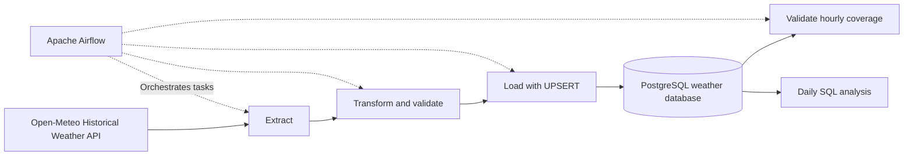
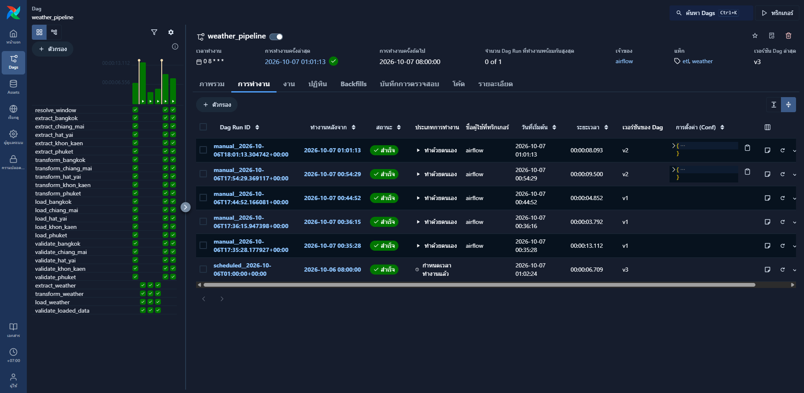
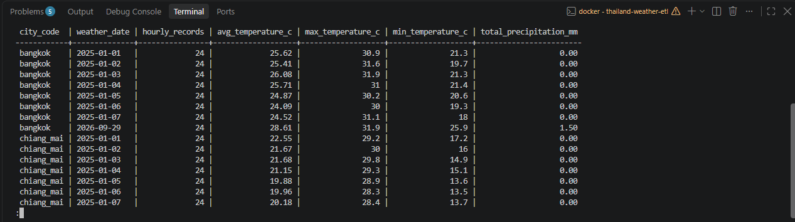
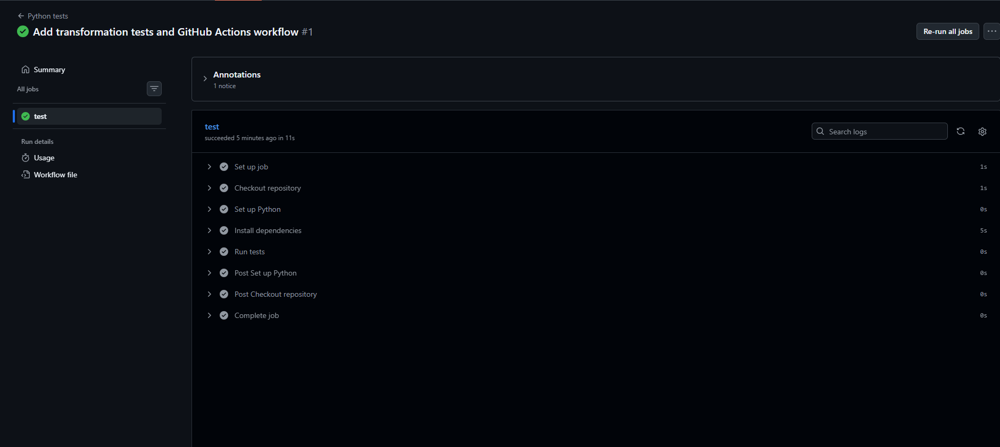

# Thailand Weather ETL

A weather data pipeline built with Python, Apache Airflow, and PostgreSQL.

The pipeline collects hourly weather data for five Thai cities,
validates and transforms the data, and upserts it into PostgreSQL
for daily analysis.

## Features

- Five cities: Bangkok, Chiang Mai, Khon Kaen, Phuket, and Hat Yai
- Historical date ranges of up to seven days per run
- Daily scheduling at 08:00 Asia/Bangkok
- Automatic mode processes one day, seven days before the run's data interval end
- Repeatable loads using PostgreSQL UPSERT
- Checks for missing values, duplicate timestamps, and invalid values
- Validation of complete hourly coverage after loading
- Daily temperature and precipitation analysis
- 11 transformation test cases with GitHub Actions CI

## Architecture



Airflow uses its own metadata database.
Weather data is stored in a separate PostgreSQL service named `warehouse`.

## Tech Stack

- Python
- Apache Airflow 3.3.1
- PostgreSQL 16
- Docker Compose
- Requests and Psycopg 3
- pytest
- GitHub Actions

## Project Structure

```text
.github/workflows/tests.yml   Automated tests
dags/weather_pipeline.py     Main Airflow DAG
dags/hello_weather.py         Introductory DAG
dags/run_local.py             Local ETL runner
dags/weather_etl/             Extraction, transformation, and loading
sql/001_create_tables.sql    Database schema
sql/analytics.sql            Daily analysis
tests/test_transform.py      Transformation tests
docs/images/                 Screenshots
Dockerfile                   Custom Airflow image
docker-compose.yaml          Airflow services
compose.warehouse.yaml       Weather database service
requirements-airflow.txt      Dependencies for the Airflow image
requirements-dev.txt          Local development dependencies
pytest.ini                   Test configuration
.env.example                 Example configuration
```

## Local Setup — Windows PowerShell

### Prerequisites

- Git
- Python 3.12
- Docker Desktop with Linux containers
- Docker Compose

### Clone the repository

```powershell
git clone https://github.com/DomeGitHub101/thailand-weather-etl.git
cd thailand-weather-etl
```

### Prepare directories and Python environment

```powershell
New-Item -ItemType Directory -Force -Path dags,logs,plugins,config,data,sql
py -3.12 -m venv .venv
.\.venv\Scripts\python.exe -m pip install -r requirements-dev.txt
```

### Configure environment variables

```powershell
Copy-Item .env.example .env
```

Set `WAREHOUSE_PASSWORD` in `.env`.

Generate a Fernet key:

```powershell
.\.venv\Scripts\python.exe -c "from cryptography.fernet import Fernet; print(Fernet.generate_key().decode())"
```

Copy the generated value into `FERNET_KEY` in `.env`.
Keep this key unchanged between restarts.

### Build the Airflow image

All Airflow services share the same custom image.
Build one service to avoid concurrent builds writing the same image tag.

```powershell
docker compose -f docker-compose.yaml -f compose.warehouse.yaml build airflow-worker
```

### Start and initialize the weather database

```powershell
docker compose -f docker-compose.yaml -f compose.warehouse.yaml up -d warehouse
docker compose -f docker-compose.yaml -f compose.warehouse.yaml ps warehouse
```

Wait for `warehouse` to become healthy, then create the table:

```powershell
docker compose -f docker-compose.yaml -f compose.warehouse.yaml exec warehouse psql -U weather -d weather -v ON_ERROR_STOP=1 -f /sql/001_create_tables.sql
```

### Initialize Airflow

```powershell
docker compose -f docker-compose.yaml -f compose.warehouse.yaml up --no-build airflow-init
```

Wait for `airflow-init` to exit with code 0.

### Start all services

```powershell
docker compose -f docker-compose.yaml -f compose.warehouse.yaml up -d --no-build
```

Open http://localhost:8080.

Default credentials for the local quick-start:

- Username: `airflow`
- Password: `airflow`

## Run the Pipeline

Enable the `weather_pipeline` DAG and trigger a run with:

```json
{
  "start_date": "2025-01-01",
  "end_date": "2025-01-07"
}
```

Both dates are inclusive.
The supported range is one to seven days per run.

When both parameters are null, the pipeline selects one day,
seven days before the run's data interval end.

Each city has four tasks:

```text
Extract → Transform → Load → Validate
```

A shared task resolves the date range before the city tasks run.

Docker and the computer must remain running for scheduled jobs.
With `catchup=False`, missed historical dates should be loaded
through explicit date-range runs.

## Verify the Results

For five cities and seven days, the expected record count
within the selected range is:

```text
5 cities × 7 days × 24 hours = 840 records
```

Run this SQL in PostgreSQL:

```sql
SELECT city_code, COUNT(*) AS hourly_records
FROM weather_hourly
WHERE observed_at >= TIMESTAMPTZ '2025-01-01 00:00:00+07'
  AND observed_at < TIMESTAMPTZ '2025-01-08 00:00:00+07'
GROUP BY city_code
ORDER BY city_code;
```

Expected result: 168 records per city.

Running the same date range again updates existing records
without adding duplicates.

## Daily Analysis

```powershell
docker compose -f docker-compose.yaml -f compose.warehouse.yaml exec warehouse psql -U weather -d weather -f /sql/analytics.sql
```

The query calculates daily average, minimum, and maximum temperature,
total precipitation, and hourly record counts.

Days are grouped using the Asia/Bangkok timezone.

## Tests

```powershell
.\.venv\Scripts\python.exe -m pytest -q
```

The tests cover:

- Preservation of weather values
- Bangkok-to-UTC time conversion
- Mismatched array lengths
- Missing weather values
- Invalid humidity
- Negative precipitation
- Duplicate timestamps
- Empty input

GitHub Actions runs these tests on pushes and pull requests.

These are transformation unit tests.
They do not automatically test the live API, database, or Airflow services.

## Screenshots

### Successful Airflow Run



### Daily Weather Summary



### Automated Tests



## Data Source and Limitations

Data is retrieved from the
[Open-Meteo Historical Weather API](https://open-meteo.com/en/docs/historical-weather-api)
using the ERA5 model.

ERA5 is reanalysis data, not direct observations from a weather station
at every requested location.

The pipeline uses a seven-day lag to allow historical data to become available.
The selected coordinates represent one location per city.

This learning version passes small datasets through Airflow XCom
and limits each run to seven days.

The local runner saves raw JSON files.
The current Airflow DAG passes API responses through XCom
without creating a separate raw-file archive.

Data-source terms and attribution requirements apply separately
from this repository's code license.

## Stop the Services

```powershell
docker compose -f docker-compose.yaml -f compose.warehouse.yaml down
```

Database data remains in Docker volumes.
Adding `-v` would remove those volumes.

## Future Improvements

- Database integration tests for UPSERT and transaction rollback
- Raw-data storage outside XCom
- Alerts when pipeline runs fail
- Dashboard for weather trends